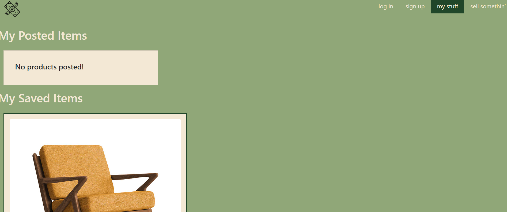

# moneybags-marketplace

Link to Repo: [GITHUB-REPO](https://github.com/mhowitz/business-adultmen)

Link to deployed site: [HEROKU-Link](http://moneybags-marketplace.herokuapp.com/)

## Description

Money Bags Marketplace is your go-to for buying and selling unique items in a sustainable way. Users can save items to purchase later, post pre-loved household goods, to make some room in their home or a bit of money.

## Table of Contents

* [Installation](#installation)
* [Usage](#usage)
* [License](#license)
* [Contributing](#contributing)
* [Questions](#questions)

## Installation

Clone the GitHub repo to the user's computer. Run "npm i" in the terminal to install all of the necessary packages. Then run "npm run develop" in order to start both front and back end servers.

## Usage

Money Bags Marketplace is a beautiful, unique resource library created by a team of experts that specialize in creating useful UI databases of all kinds. Create a user profile, post items for sale, find items to purchase, save some for later, and so much more!

Homepage:

Login page:

User profile:

Posting an article:

## License 

[MIT License Link](https://choosealicense.com/licenses/mit/)

MIT License

Copyright (c) 2022 Mikayla Howitz

Permission is hereby granted, free of charge, to any person obtaining a copy of this software and associated documentation files (the "Software"), to deal in the Software without restriction, including without limitation the rights to use, copy, modify, merge, publish, distribute, sublicense, and/or sell copies of the Software, and to permit persons to whom the Software is furnished to do so, subject to the following conditions:

The above copyright notice and this permission notice shall be included in all copies or substantial portions of the Software.

THE SOFTWARE IS PROVIDED "AS IS", WITHOUT WARRANTY OF ANY KIND, EXPRESS OR IMPLIED, INCLUDING BUT NOT LIMITED TO THE WARRANTIES OF MERCHANTABILITY, FITNESS FOR A PARTICULAR PURPOSE AND NONINFRINGEMENT. IN NO EVENT SHALL THE AUTHORS OR COPYRIGHT HOLDERS BE LIABLE FOR ANY CLAIM, DAMAGES OR OTHER LIABILITY, WHETHER IN AN ACTION OF CONTRACT, TORT OR OTHERWISE, ARISING FROM, OUT OF OR IN CONNECTION WITH THE SOFTWARE OR THE USE OR OTHER DEALINGS IN THE SOFTWARE.

## Contributing
Jason Wisniewski  
Sabriel Gee  
Mikayla Howitz  
David Tait  

## Questions
Github usernames: mhowitz, davidtait1996, JasonWisniewski, sabrielg

Github link : https://github.com/mhowitz/business-adultmen
